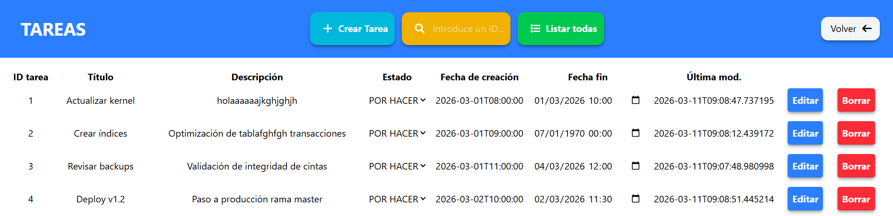
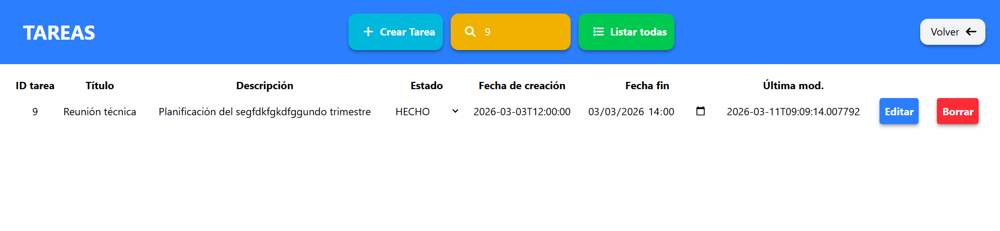
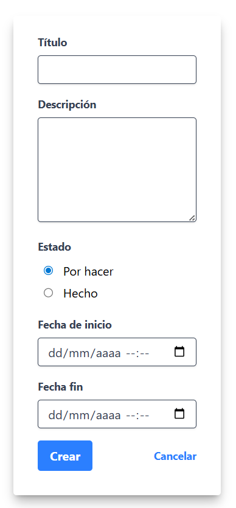
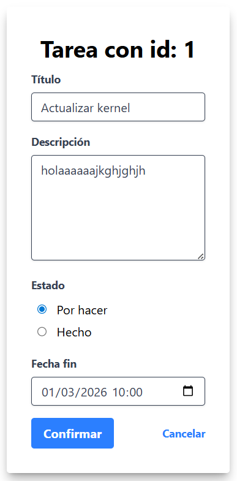
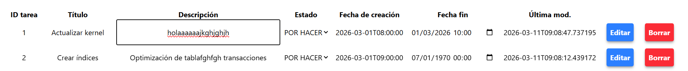

# API REST con Spring Boot 4 y Java 21

Implementación de una **API RESTful** utilizando **Java 21** y **Spring Boot 4**; gestionado con **Maven** y que utiliza **H2** y **MySQL** como gestor de datos.

La aplicación consta de una API que permite obtener e introducir datos en una BD de prueba con una muestra de datos pequeña de ejemplo, así como una interfaz simple en HTML y JS para consumirla; cuenta con las siguientes funcionalidades:

* Listar Tareas
* Insertar Tareas
* Modificar una tarea concreta
* Borrar una tarea concreta
* Modificar un campo concreto de una tarea
* Buscar tarea por ID

---

## Documentación

Tanto en este README como en la carpeta docs se puede encontrar la documentación correspondiente al proyecto; tanto el SCHEMA de la tabla de tareas como los API_ENDPOINTS detallados.

* [Api endpoints](./docs/api_endpoints.md)
* [SCHEMA](./docs/db_schema.md)

---

## Ejecución

La aplicación se puede ejecutar directamente sin necesidad de realizar ninguna migración ni descargar ninguna dependencia; esta hace uso de CDNs tanto de Font Awesome como de TailWindCSS, por lo que el uso de esta aplicación es meramente didáctica y NO está diseñada para producción.

Para ejecutarla, se debe tener disponible el **puerto 8080** para el arranque de la aplicación; esta se puede ejecutar a partir de un IDE que permita ejecutar aplicaciones de Java (Eclipse IDE, VSCode, IntelliJ) a través del archivo CrudRestApplication.java dentro de **src/main/java/com/practica/crud_apirest**.

---

## Tecnologías y Herramientas

* **Lenguaje:** Java 21 (LTS), JavaScript
* **Framework:** Spring Boot 4.x
* **Gestión de Dependencias:** Maven 3.9+
* **Persistencia:** Spring Data JPA y Hibernate
* **Base de Datos:** H2 (Archivo "db_tareas") / mySQL (desactivado por defecto)
* **Front End**: Font Awesome, TailwindCSS (CDN)

---

## Funcionalidades CRUD

El proyecto cuenta con gestión completa de tareas:

1. **GET** /api/tasks
2. **GET** /api/tasks/{id}
3. **POST** /api/tasks
4. **PUT** /api/tasks/{id}
5. **PATCH** /api/tasks/{id}/{campo}
6. **DELETE** /api/tasks/{id}

---

## Muestra de Front End

### Inicio de la app

### Listado de tareas

### Buscar tarea

### Añadir tarea

### Editar tarea (todos los campos)

### Editar tarea (campo único)

